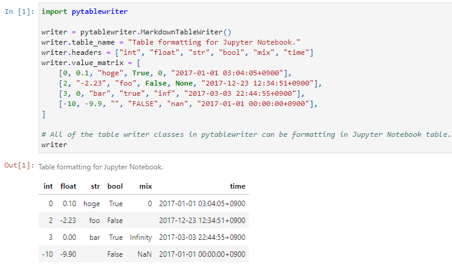

.. contents:: **pytablewriter**
   :backlinks: top
   :depth: 2

Summary
=========
`pytablewriter <https://github.com/thombashi/pytablewriter>`__ is a Python library to write a table in various formats: CSV / Elasticsearch / HTML / JavaScript / JSON / LaTeX / LDJSON / LTSV / Markdown / MediaWiki / NumPy / Excel / Pandas / Python / reStructuredText / SQLite / TOML / TSV / YAML.

.. image:: https://badge.fury.io/py/pytablewriter.svg
    :target: https://badge.fury.io/py/pytablewriter
    :alt: PyPI package version

.. image:: https://img.shields.io/pypi/pyversions/pytablewriter.svg
    :target: https://pypi.org/project/pytablewriter/
    :alt: Supported Python versions

.. image:: https://img.shields.io/pypi/implementation/pytablewriter.svg
    :target: https://pypi.org/project/pytablewriter
    :alt: Supported Python implementations

.. image:: https://img.shields.io/travis/thombashi/pytablewriter/master.svg?label=Linux/macOS%20CI
    :target: https://travis-ci.org/thombashi/pytablewriter
    :alt: Linux/macOS CI status

.. image:: https://img.shields.io/appveyor/ci/thombashi/pytablewriter/master.svg?label=Windows%20CI
    :target: https://ci.appveyor.com/project/thombashi/pytablewriter
    :alt: Windows CI status

.. image:: https://coveralls.io/repos/github/thombashi/pytablewriter/badge.svg?branch=master
    :target: https://coveralls.io/github/thombashi/pytablewriter?branch=master
    :alt: Test coverage

.. image:: https://img.shields.io/github/stars/thombashi/pytablewriter.svg?style=social&label=Star
    :target: https://github.com/thombashi/pytablewriter
    :alt: GitHub stars

Features
--------
- Write a table in various formats:
    - Text formats:
        - CSV / Tab-separated values (TSV)
        - CSS
        - HTML
        - JSON
        - `Labeled Tab-separated Values (LTSV) <http://ltsv.org/>`__
        - `Line-delimited JSON(LDJSON) <https://en.wikipedia.org/wiki/JSON_streaming#Line-delimited_JSON>`__/NDJSON/JSON Lines
        - LaTeX: ``tabular``/``array`` environment
        - Markdown
        - MediaWiki
        - reStructuredText: `Grid Tables <http://docutils.sourceforge.net/docs/ref/rst/restructuredtext.html#grid-tables>`__/`Simple Tables <http://docutils.sourceforge.net/docs/ref/rst/restructuredtext.html#simple-tables>`__/`CSV Table <http://docutils.sourceforge.net/docs/ref/rst/directives.html#id4>`__
        - Source code
            - JavaScript code (Definition of a nested list variable)
            - `NumPy <https://www.numpy.org/>`__ (Definition of a `numpy.array <https://docs.scipy.org/doc/numpy/reference/generated/numpy.array.html>`__ variable)
            - `Pandas <https://pandas.pydata.org/>`__ (Definition of a `pandas.DataFrame <https://pandas.pydata.org/pandas-docs/stable/reference/api/pandas.DataFrame.html>`__ variable)
            - Python code (Definition of a nested list variable)
        - Space aligned values
        - `TOML <https://github.com/toml-lang/toml>`__
        - `YAML <https://yaml.org/>`__
        - Unicode
    - Binary file formats:
        - Microsoft Excel :superscript:`TM` (``.xlsx``/``.xls`` file format)
        - SQLite database
    - Application specific formats:
        - `Elasticsearch <https://www.elastic.co/products/elasticsearch>`__
- Automatic tabular data formatting
    - Alignment
    - Padding
    - Decimal places of numbers
- Configure cell styles:
    - Text/Background color
    - Text alignment
    - Font size/weight
    - Thousand separator for numbers: e.g. ``1,000``/``1 000``
- Configure output:
    - Write table to a stream such as a file/standard-output/string-buffer/Jupyter-Notebook
    - Get rendered tabular text
- Data source
    - nested list
    - CSV
    - `pandas.DataFrame <https://pandas.pydata.org/pandas-docs/stable/reference/api/pandas.DataFrame.html>`__
    - `pandas.Series <https://pandas.pydata.org/pandas-docs/stable/reference/api/pandas.Series.html>`__
    - etc.
- Multibyte character support
- ANSI color support

Examples
==========
Write tables
--------------
Write a Markdown table
~~~~~~~~~~~~~~~~~~~~~~~~
:Sample Code:
    .. code-block:: python

        from pytablewriter import MarkdownTableWriter

        def main():
            writer = MarkdownTableWriter()
            writer.table_name = "example_table"
            writer.headers = ["int", "float", "str", "bool", "mix", "time"]
            writer.value_matrix = [
                [0,   0.1,      "hoge", True,   0,      "2017-01-01 03:04:05+0900"],
                [2,   "-2.23",  "foo",  False,  None,   "2017-12-23 45:01:23+0900"],
                [3,   0,        "bar",  "true",  "inf", "2017-03-03 33:44:55+0900"],
                [-10, -9.9,     "",     "FALSE", "nan", "2017-01-01 00:00:00+0900"],
            ]

            writer.write_table()

        if __name__ == "__main__":
            main()

:Output:
    .. code-block::

        # example_table
        |int|float|str |bool |  mix   |          time          |
        |--:|----:|----|-----|-------:|------------------------|
        |  0| 0.10|hoge|True |       0|2017-01-01 03:04:05+0900|
        |  2|-2.23|foo |False|        |2017-12-23 12:34:51+0900|
        |  3| 0.00|bar |True |Infinity|2017-03-03 22:44:55+0900|
        |-10|-9.90|    |False|     NaN|2017-01-01 00:00:00+0900|

:Rendering Result:
    .. figure:: ss/markdown.png
       :scale: 80%
       :alt: markdown_ss

       Rendered markdown at GitHub

Write a Markdown table with a margin
^^^^^^^^^^^^^^^^^^^^^^^^^^^^^^^^^^^^^^
:Sample Code:
    .. code-block:: python

        from pytablewriter import MarkdownTableWriter

        def main():
            writer = MarkdownTableWriter()
            writer.table_name = "write example with a margin"
            writer.headers = ["int", "float", "str", "bool", "mix", "time"]
            writer.value_matrix = [
                [0,   0.1,      "hoge", True,   0,      "2017-01-01 03:04:05+0900"],
                [2,   "-2.23",  "foo",  False,  None,   "2017-12-23 45:01:23+0900"],
                [3,   0,        "bar",  "true",  "inf", "2017-03-03 33:44:55+0900"],
                [-10, -9.9,     "",     "FALSE", "nan", "2017-01-01 00:00:00+0900"],
            ]
            writer.margin = 1  # add a whitespace for both sides of each cell

            writer.write_table()

        if __name__ == "__main__":
            main()

:Output:
    .. code-block::

        # write example with a margin
        | int | float | str  | bool  |   mix    |           time           |
        |----:|------:|------|-------|---------:|--------------------------|
        |   0 |  0.10 | hoge | True  |        0 | 2017-01-01 03:04:05+0900 |
        |   2 | -2.23 | foo  | False |          | 2017-12-23 12:34:51+0900 |
        |   3 |  0.00 | bar  | True  | Infinity | 2017-03-03 22:44:55+0900 |
        | -10 | -9.90 |      | False |      NaN | 2017-01-01 00:00:00+0900 |

``margin`` attribute can be available for all of the text format writer classes.

Write a reStructuredText table (Grid Tables)
~~~~~~~~~~~~~~~~~~~~~~~~~~~~~~~~~~~~~~~~~~~~~~
:Sample Code:
    .. code-block:: python

        import pytablewriter

        def main():
            writer = pytablewriter.RstGridTableWriter()
            writer.table_name = "example_table"
            writer.headers = ["int", "float", "str", "bool", "mix", "time"]
            writer.value_matrix = [
                [0,   0.1,      "hoge", True,   0,      "2017-01-01 03:04:05+0900"],
                [2,   "-2.23",  "foo",  False,  None,   "2017-12-23 45:01:23+0900"],
                [3,   0,        "bar",  "true",  "inf", "2017-03-03 33:44:55+0900"],
                [-10, -9.9,     "",     "FALSE", "nan", "2017-01-01 00:00:00+0900"],
            ]

            writer.write_table()

        if __name__ == "__main__":
            main()

:Output:
    .. code-block:: ReST

        .. table:: example_table

            +---+-----+----+-----+--------+------------------------+
            |int|float|str |bool |  mix   |          time          |
            +===+=====+====+=====+========+========================+
            |  0| 0.10|hoge|True |       0|2017-01-01 03:04:05+0900|
            +---+-----+----+-----+--------+------------------------+
            |  2|-2.23|foo |False|        |2017-12-23 12:34:51+0900|
            +---+-----+----+-----+--------+------------------------+
            |  3| 0.00|bar |True |Infinity|2017-03-03 22:44:55+0900|
            +---+-----+----+-----+--------+------------------------+
            |-10|-9.90|    |False|     NaN|2017-01-01 00:00:00+0900|
            +---+-----+----+-----+--------+------------------------+

:Rendering Result:
    .. table:: example_table

        +---+-----+----+-----+--------+------------------------+
        |int|float|str |bool |  mix   |          time          |
        +===+=====+====+=====+========+========================+
        |  0| 0.10|hoge|True |       0|2017-01-01 03:04:05+0900|
        +---+-----+----+-----+--------+------------------------+
        |  2|-2.23|foo |False|        |2017-12-23 12:34:51+0900|
        +---+-----+----+-----+--------+------------------------+
        |  3| 0.00|bar |True |Infinity|2017-03-03 22:44:55+0900|
        +---+-----+----+-----+--------+------------------------+
        |-10|-9.90|    |False|     NaN|2017-01-01 00:00:00+0900|
        +---+-----+----+-----+--------+------------------------+

Write a table with JavaScript format (as a nested list variable definition)
~~~~~~~~~~~~~~~~~~~~~~~~~~~~~~~~~~~~~~~~~~~~~~~~~~~~~~~~~~~~~~~~~~~~~~~~~~~~~
:Sample Code:
    .. code-block:: python

        import pytablewriter

        def main():
            writer = pytablewriter.JavaScriptTableWriter()
            writer.table_name = "example_table"
            writer.headers = ["int", "float", "str", "bool", "mix", "time"]
            writer.value_matrix = [
                [0,   0.1,      "hoge", True,   0,      "2017-01-01 03:04:05+0900"],
                [2,   "-2.23",  "foo",  False,  None,   "2017-12-23 45:01:23+0900"],
                [3,   0,        "bar",  "true",  "inf", "2017-03-03 33:44:55+0900"],
                [-10, -9.9,     "",     "FALSE", "nan", "2017-01-01 00:00:00+0900"],
            ]

            writer.write_table()

        if __name__ == "__main__":
            main()

:Output:
    .. code-block:: js

        const example_table = [
            ["int", "float", "str", "bool", "mix", "time"],
            [0, 0.10, "hoge", true, 0, "2017-01-01 03:04:05+0900"],
            [2, -2.23, "foo", false, null, "2017-12-23 12:34:51+0900"],
            [3, 0.00, "bar", true, Infinity, "2017-03-03 22:44:55+0900"],
            [-10, -9.90, "", false, NaN, "2017-01-01 00:00:00+0900"]
        ];

Write a table to an Excel sheet
~~~~~~~~~~~~~~~~~~~~~~~~~~~~~~~~~
:Sample Code:
    .. code-block:: python

        from pytablewriter import ExcelXlsxTableWriter

        def main():
            writer = ExcelXlsxTableWriter()
            writer.table_name = "example"
            writer.headers = ["int", "float", "str", "bool", "mix", "time"]
            writer.value_matrix = [
                [0,   0.1,      "hoge", True,   0,      "2017-01-01 03:04:05+0900"],
                [2,   "-2.23",  "foo",  False,  None,   "2017-12-23 12:34:51+0900"],
                [3,   0,        "bar",  "true",  "inf", "2017-03-03 22:44:55+0900"],
                [-10, -9.9,     "",     "FALSE", "nan", "2017-01-01 00:00:00+0900"],
            ]
            writer.dump("sample.xlsx")

        if __name__ == "__main__":
            main()

:Output:
    .. figure:: ss/excel_single.png
       :scale: 100%
       :alt: excel_single

       Output excel file (``sample_single.xlsx``)

Write a Unicode table
~~~~~~~~~~~~~~~~~~~~~~~
:Sample Code:
    .. code-block:: python

        from pytablewriter import UnicodeTableWriter

        def main():
            writer = UnicodeTableWriter()
            writer.table_name = "example_table"
            writer.headers = ["int", "float", "str", "bool", "mix", "time"]
            writer.value_matrix = [
                [0,   0.1,      "hoge", True,   0,      "2017-01-01 03:04:05+0900"],
                [2,   "-2.23",  "foo",  False,  None,   "2017-12-23 45:01:23+0900"],
                [3,   0,        "bar",  "true",  "inf", "2017-03-03 33:44:55+0900"],
                [-10, -9.9,     "",     "FALSE", "nan", "2017-01-01 00:00:00+0900"],
            ]

            writer.write_table()

        if __name__ == "__main__":
            main()

:Output:
    .. code-block::

        ┌───┬─────┬────┬─────┬────────┬────────────────────────┐
        │int│float│str │bool │  mix   │          time          │
        ├───┼─────┼────┼─────┼────────┼────────────────────────┤
        │  0│ 0.10│hoge│True │       0│2017-01-01 03:04:05+0900│
        ├───┼─────┼────┼─────┼────────┼────────────────────────┤
        │  2│-2.23│foo │False│        │2017-12-23 12:34:51+0900│
        ├───┼─────┼────┼─────┼────────┼────────────────────────┤
        │  3│ 0.00│bar │True │Infinity│2017-03-03 22:44:55+0900│
        ├───┼─────┼────┼─────┼────────┼────────────────────────┤
        │-10│-9.90│    │False│     NaN│2017-01-01 00:00:00+0900│
        └───┴─────┴────┴─────┴────────┴────────────────────────┘

Write a Markdown table from ``pandas.DataFrame`` instance
~~~~~~~~~~~~~~~~~~~~~~~~~~~~~~~~~~~~~~~~~~~~~~~~~~~~~~~~~~~
``from_dataframe`` method of writer classes will set up tabular data from ``pandas.DataFrame``:

:Sample Code:
    .. code-block:: python

        from textwrap import dedent
        import pandas as pd
        import io
        from pytablewriter import MarkdownTableWriter

        def main():
            csv_data = io.StringIO(dedent("""\
                "i","f","c","if","ifc","bool","inf","nan","mix_num","time"
                1,1.10,"aa",1.0,"1",True,Infinity,NaN,1,"2017-01-01 00:00:00+09:00"
                2,2.20,"bbb",2.2,"2.2",False,Infinity,NaN,Infinity,"2017-01-02 03:04:05+09:00"
                3,3.33,"cccc",-3.0,"ccc",True,Infinity,NaN,NaN,"2017-01-01 00:00:00+09:00"
                """))
            df = pd.read_csv(csv_data, sep=',')

            writer = MarkdownTableWriter()
            writer.from_dataframe(df)
            writer.write_table()

        if __name__ == "__main__":
            main()

:Output:
    .. code-block::

        | i | f  | c  | if |ifc|bool |  inf   |nan|mix_num |          time           |
        |--:|---:|----|---:|---|-----|--------|---|-------:|-------------------------|
        |  1|1.10|aa  | 1.0|  1|True |Infinity|NaN|       1|2017-01-01 00:00:00+09:00|
        |  2|2.20|bbb | 2.2|2.2|False|Infinity|NaN|Infinity|2017-01-02 03:04:05+09:00|
        |  3|3.33|cccc|-3.0|ccc|True |Infinity|NaN|     NaN|2017-01-01 00:00:00+09:00|

Adding a column of the DataFrame index if you specify ``add_index_column=True``:

:Sample Code:
    .. code-block:: python

        import pandas as pd
        from pytablewriter import MarkdownTableWriter

        def main():
            writer = MarkdownTableWriter()
            writer.table_name = "add_index_column"
            writer.from_dataframe(
                pd.DataFrame({"A": [1, 2], "B": [10, 11]}, index=["a", "b"]),
                add_index_column=True,
            )
            writer.write_table()

        if __name__ == "__main__":
            main()

:Output:
    .. code-block::

        # add_index_column
        |   | A | B |
        |---|--:|--:|
        |a  |  1| 10|
        |b  |  2| 11|

Write a markdown table from a space-separated values
~~~~~~~~~~~~~~~~~~~~~~~~~~~~~~~~~~~~~~~~~~~~~~~~~~~~~~
:Sample Code:
    .. code-block:: python

        from textwrap import dedent
        import pytablewriter

        def main():
            writer = pytablewriter.MarkdownTableWriter()
            writer.table_name = "ps"
            writer.from_csv(
                dedent("""\
                    USER       PID %CPU %MEM    VSZ   RSS TTY      STAT START   TIME COMMAND
                    root         1  0.0  0.4  77664  8784 ?        Ss   May11   0:02 /sbin/init
                    root         2  0.0  0.0      0     0 ?        S    May11   0:00 [kthreadd]
                    root         4  0.0  0.0      0     0 ?        I<   May11   0:00 [kworker/0:0H]
                    root         6  0.0  0.0      0     0 ?        I<   May11   0:00 [mm_percpu_wq]
                    root         7  0.0  0.0      0     0 ?        S    May11   0:01 [ksoftirqd/0]
                """),
                delimiter=" ")
            writer.write_table()

        if __name__ == "__main__":
            main()

:Output:
    .. code-block::

        # ps
        |USER|PID|%CPU|%MEM| VSZ |RSS |TTY|STAT|START|TIME|   COMMAND    |
        |----|--:|---:|---:|----:|---:|---|----|-----|----|--------------|
        |root|  1|   0| 0.4|77664|8784|?  |Ss  |May11|0:02|/sbin/init    |
        |root|  2|   0| 0.0|    0|   0|?  |S   |May11|0:00|[kthreadd]    |
        |root|  4|   0| 0.0|    0|   0|?  |I<  |May11|0:00|[kworker/0:0H]|
        |root|  6|   0| 0.0|    0|   0|?  |I<  |May11|0:00|[mm_percpu_wq]|
        |root|  7|   0| 0.0|    0|   0|?  |S   |May11|0:01|[ksoftirqd/0] |

Get rendered tabular text as str
----------------------------------
``dumps`` method returns rendered tabular text.
``dumps`` only available for text format writers.

:Sample Code:
    .. code-block:: python

        import pytablewriter

        def main():
            writer = pytablewriter.MarkdownTableWriter()
            writer.headers = ["int", "float", "str", "bool", "mix", "time"]
            writer.value_matrix = [
                [0,   0.1,      "hoge", True,   0,      "2017-01-01 03:04:05+0900"],
                [2,   "-2.23",  "foo",  False,  None,   "2017-12-23 45:01:23+0900"],
                [3,   0,        "bar",  "true",  "inf", "2017-03-03 33:44:55+0900"],
                [-10, -9.9,     "",     "FALSE", "nan", "2017-01-01 00:00:00+0900"],
            ]

            print(writer.dumps())

        if __name__ == "__main__":
            main()

:Output:
    .. code-block::

        |int|float|str |bool |  mix   |          time          |
        |--:|----:|----|-----|-------:|------------------------|
        |  0| 0.10|hoge|True |       0|2017-01-01 03:04:05+0900|
        |  2|-2.23|foo |False|        |2017-12-23 45:01:23+0900|
        |  3| 0.00|bar |True |Infinity|2017-03-03 33:44:55+0900|
        |-10|-9.90|    |False|     NaN|2017-01-01 00:00:00+0900|

Configure table styles
------------------------
Writers can specify cell
`Style <https://pytablewriter.rtfd.io/en/latest/pages/reference/style.html>`__
for each column manually by ``column_styles`` attribute of writer classes.

:Sample Code:
    .. code-block:: python

        from pytablewriter import MarkdownTableWriter
        from pytablewriter.style import Style

        def main():
            writer = MarkdownTableWriter()
            writer.table_name = "set style by column_styles"
            writer.headers = [
                "auto align",
                "left align",
                "center align",
                "bold",
                "italic",
                "bold italic ts",
            ]
            writer.value_matrix = [
                [11, 11, 11, 11, 11, 11],
                [1234, 1234, 1234, 1234, 1234, 1234],
            ]

            # specify styles for each column
            writer.column_styles = [
                Style(),
                Style(align="left"),
                Style(align="center"),
                Style(font_weight="bold"),
                Style(font_style="italic"),
                Style(font_weight="bold", font_style="italic", thousand_separator=","),
            ]

            writer.write_table()

        if __name__ == "__main__":
            main()

:Output:
    .. code-block::

        # set style by styles
        |auto align|left align|center align|  bold  |italic|bold italic ts|
        |---------:|----------|:----------:|-------:|-----:|-------------:|
        |        11|11        |     11     |  **11**|  _11_|      _**11**_|
        |      1234|1234      |    1234    |**1234**|_1234_|   _**1,234**_|

    `Rendering result <https://github.com/thombashi/pytablewriter/tree/master/docs/pages/examples/style/output.md>`__

You can also set ``Style`` to a specific column with index or header by using ``set_style`` method:

:Sample Code:
    .. code-block:: python

        from pytablewriter import MarkdownTableWriter
        from pytablewriter.style import Style

        def main():
            writer = MarkdownTableWriter()
            writer.headers = ["A", "B", "C",]
            writer.value_matrix = [[11, 11, 11], [1234, 1234, 1234]]

            writer.table_name = "set style by column index"
            writer.set_style(1, Style(align="center", font_weight="bold"))
            writer.set_style(2, Style(thousand_separator=" "))
            writer.write_table()
            writer.write_null_line()

            writer.table_name = "set style by header"
            writer.set_style("B", Style(font_style="italic"))
            writer.write_table()

        if __name__ == "__main__":
            main()

:Output:
    .. code-block::

        # set style by column index
        | A  |   B    |  C  |
        |---:|:------:|----:|
        |  11| **11** |   11|
        |1234|**1234**|1 234|

        # set style by header
        | A  |  B   |  C  |
        |---:|-----:|----:|
        |  11|  _11_|   11|
        |1234|_1234_|1 234|

Style filter
--------------
Example:

.. figure:: ss/color_filter.png
    :scale: 60%
    :alt: true_color_and_styles

Make tables for specific applications
---------------------------------------
Render a table on Jupyter Notebook
~~~~~~~~~~~~~~~~~~~~~~~~~~~~~~~~~~~~
https://nbviewer.jupyter.org/github/thombashi/pytablewriter/blob/master/examples/ipynb/jupyter_notebook_example.ipynb

   Table formatting for Jupyter Notebook

Multibyte character support
-----------------------------
Write a table using multibyte character
~~~~~~~~~~~~~~~~~~~~~~~~~~~~~~~~~~~~~~~~~
You can use multibyte characters as table data.
Multibyte characters also properly padded and aligned.

:Sample Code:
    .. code-block:: python

        import pytablewriter

        def main():
            writer = pytablewriter.RstSimpleTableWriter()
            writer.table_name = "生成に関するパターン"
            writer.headers = ["パターン名", "概要", "GoF", "Code Complete[1]"]
            writer.value_matrix = [
                ["Abstract Factory", "関連する一連のインスタンスを状況に応じて、適切に生成する方法を提供する。", "Yes", "Yes"],
                ["Builder", "複合化されたインスタンスの生成過程を隠蔽する。", "Yes", "No"],
                ["Factory Method", "実際に生成されるインスタンスに依存しない、インスタンスの生成方法を提供する。", "Yes", "Yes"],
                ["Prototype", "同様のインスタンスを生成するために、原型のインスタンスを複製する。", "Yes", "No"],
                ["Singleton", "あるクラスについて、インスタンスが単一であることを保証する。", "Yes", "Yes"],
            ]
            writer.write_table()

        if __name__ == "__main__":
            main()

:Output:
    .. figure:: ss/multi_byte_char.png
       :scale: 100%
       :alt: multi_byte_char_table

       Output of multi-byte character table

Multi processing
------------------
You can increase the number of workers to process table data via ``max_workers`` attribute of a writer.
The more ``max_workers`` the less processing time when tabular data is large and the execution environment has available cores.

Create Elasticsearch index and put data
-----------------------------------------
:Sample Code:
    .. code-block:: python

        import datetime
        import json

        from elasticsearch import Elasticsearch
        import pytablewriter as ptw

        def main():
            es = Elasticsearch(hosts="localhost:9200")

            writer = ptw.ElasticsearchWriter()
            writer.stream = es
            writer.index_name = "es writer example"
            writer.headers = [
                "str", "byte", "short", "int", "long", "float", "date", "bool", "ip",
            ]
            writer.value_matrix = [
                [
                    "abc", 100, 10000, 2000000000, 200000000000, 0.1,
                    datetime.datetime(2017, 1, 2, 3, 4, 5), True, "127.0.0.1",
                ],
                [
                    "def", -10, -1000, -200000000, -20000000000, 100.1,
                    datetime.datetime(2017, 6, 5, 4, 5, 2), False, "::1",
                ],
            ]

            # delete existing index ---
            es.indices.delete(index=writer.index_name, ignore=404)

            # create an index and put data ---
            writer.write_table()

            # display the result ---
            es.indices.refresh(index=writer.index_name)

            print("----- mappings -----")
            response = es.indices.get_mapping(index=writer.index_name, doc_type="table")
            print("{}\n".format(json.dumps(response, indent=4)))

            print("----- documents -----")
            response = es.search(
                index=writer.index_name,
                doc_type="table",
                body={
                    "query": {"match_all": {}}
                }
            )
            for hit in response["hits"]["hits"]:
                print(json.dumps(hit["_source"], indent=4))

        if __name__ == "__main__":
            main()

:Output:
    .. code-block::

        ----- mappings -----
        {
            "es_writer_example": {
                "mappings": {
                    "table": {
                        "properties": {
                            "bool": {
                                "type": "boolean"
                            },
                            "byte": {
                                "type": "byte"
                            },
                            "date": {
                                "type": "date",
                                "format": "date_optional_time"
                            },
                            "float": {
                                "type": "double"
                            },
                            "int": {
                                "type": "integer"
                            },
                            "ip": {
                                "type": "text"
                            },
                            "long": {
                                "type": "long"
                            },
                            "short": {
                                "type": "short"
                            },
                            "str": {
                                "type": "text"
                            }
                        }
                    }
                }
            }
        }

        ----- documents -----
        {
            "str": "def",
            "byte": -10,
            "short": -1000,
            "int": -200000000,
            "long": -20000000000,
            "float": 100.1,
            "date": "2017-06-05T04:05:02",
            "bool": false,
            "ip": "::1"
        }
        {
            "str": "abc",
            "byte": 100,
            "short": 10000,
            "int": 2000000000,
            "long": 200000000000,
            "float": 0.1,
            "date": "2017-01-02T03:04:05",
            "bool": true,
            "ip": "127.0.0.1"
        }

For more information
----------------------
More examples are available at 
https://pytablewriter.rtfd.io/en/latest/pages/examples/index.html

Installation
============

Install from PyPI
------------------------------
::

    pip install pytablewriter

Some of the formats require additional dependency packages, you can install the dependency packages as follows:

- Elasticsearch
    - ``pip install pytablewriter[es6]`` or ``pip install pytablewriter[es5]``
- Excel
    - ``pip install pytablewriter[excel]``
- HTML
    - ``pip install pytablewriter[html]``
- SQLite
    - ``pip install pytablewriter[sqlite]``
- TOML
    - ``pip install pytablewriter[toml]``
- Install all of the optioanal dependencies
    - ``pip install pytablewriter[all]``

Install from PPA (for Ubuntu)
------------------------------
::

    sudo add-apt-repository ppa:thombashi/ppa
    sudo apt update
    sudo apt install python3-pytablewriter

Dependencies
============
Python 3.5+

- `DataProperty <https://github.com/thombashi/DataProperty>`__
- `mbstrdecoder <https://github.com/thombashi/mbstrdecoder>`__
- `msgfy <https://github.com/thombashi/msgfy>`__
- `pathvalidate <https://github.com/thombashi/pathvalidate>`__
- `tabledata <https://github.com/thombashi/tabledata>`__
- `tcolorpy <https://github.com/thombashi/tcolorpy>`__
- `typepy <https://github.com/thombashi/typepy>`__

Optional dependencies
---------------------
- `loguru <https://github.com/Delgan/loguru>`__
    - Used for logging if the package installed
- `pytablereader <https://github.com/thombashi/pytablereader>`__
- `simplejson <https://github.com/simplejson/simplejson>`__
- Elasticsearch:
    - `elasticsearch <https://github.com/elastic/elasticsearch-py>`__
- Excel
    - `xlwt <http://www.python-excel.org/>`__
    - `XlsxWriter <https://github.com/jmcnamara/XlsxWriter>`__
- HTML
    - `dominate <https://github.com/Knio/dominate/>`__
- SQLite
    - `SimpleSQLite <https://github.com/thombashi/SimpleSQLite>`__
- TOML
    - `toml <https://github.com/uiri/toml>`__

Test dependencies
-----------------
- `pytest <https://docs.pytest.org/en/latest/>`__
- `tox <https://testrun.org/tox/latest/>`__

Documentation
===============
https://pytablewriter.rtfd.io/

Related Project
=================
- `pytablereader <https://github.com/thombashi/pytablereader>`__
    - Tabular data loaded by ``pytablereader`` can be written another tabular data format with ``pytablewriter``.

Tasks
=======
https://trello.com/b/kE0XG34y

