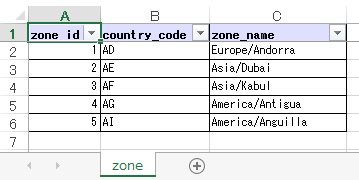

pytablewriter
=============

.. image:: https://badge.fury.io/py/pytablewriter.svg
    :target: https://badge.fury.io/py/pytablewriter

.. image:: https://img.shields.io/pypi/pyversions/pytablewriter.svg
   :target: https://pypi.python.org/pypi/pytablewriter

.. image:: https://img.shields.io/travis/thombashi/pytablewriter/master.svg?label=Linux
    :target: https://travis-ci.org/thombashi/pytablewriter

.. image:: https://img.shields.io/appveyor/ci/thombashi/pytablewriter/master.svg?label=Windows
    :target: https://ci.appveyor.com/project/thombashi/pytablewriter

.. image:: https://coveralls.io/repos/github/thombashi/pytablewriter/badge.svg?branch=master
    :target: https://coveralls.io/github/thombashi/pytablewriter?branch=master

.. image:: https://img.shields.io/github/stars/thombashi/pytablewriter.svg?style=social&label=Star
   :target: https://github.com/thombashi/pytablewriter

Summary
-------

A python library to write a table in various formats: CSV / Elasticsearch / HTML / JavaScript / JSON / LTSV / Markdown / MediaWiki / Excel / Pandas / Python / reStructuredText / SQLite / TOML / TSV.

Features
--------

- Write a table in various formats:
    - CSV
    - `Elasticsearch <https://www.elastic.co/products/elasticsearch>`__
    - Microsoft Excel :superscript:`TM` (``.xlsx``/``.xls`` file format)
    - HTML
    - JSON
    - `Labeled Tab-separated Values (LTSV) <http://ltsv.org/>`__
    - Markdown
    - MediaWiki
    - reStructuredText: `Grid Tables <http://docutils.sourceforge.net/docs/ref/rst/restructuredtext.html#grid-tables>`__/`Simple Tables <http://docutils.sourceforge.net/docs/ref/rst/restructuredtext.html#simple-tables>`__/`CSV Table <http://docutils.sourceforge.net/docs/ref/rst/directives.html#id4>`__
    - Source code
        - `Pandas <http://pandas.pydata.org/>`__ (Definition of a - `pandas.DataFrame <http://pandas.pydata.org/pandas-docs/stable/generated/pandas.DataFrame.html>`__ variable)
        - Python code (Definition of a nested list variable)
        - JavaScript code (Definition of a nested list variable)
    - SQLite database file
    - Tab-separated values (TSV)
    - `TOML <https://github.com/toml-lang/toml>`__
- Automatic tabular data formatting
    - Alignment
    - Padding
    - Decimal places of numbers
- Multibyte character support
- Write table to a stream such as a file/standard-output/string-buffer

Examples
========

Write a Markdown table
----------------------

.. code:: python

    import pytablewriter

    writer = pytablewriter.MarkdownTableWriter()
    writer.table_name = "example_table"
    writer.header_list = ["int", "float", "str", "bool", "mix", "time"]
    writer.value_matrix = [
        [0,   0.1,      "hoge", True,   0,      "2017-01-01 03:04:05+0900"],
        [2,   "-2.23",  "foo",  False,  None,   "2017-12-23 45:01:23+0900"],
        [3,   0,        "bar",  "true",  "inf", "2017-03-03 33:44:55+0900"],
        [-10, -9.9,     "",     "FALSE", "nan", "2017-01-01 00:00:00+0900"],
    ]

    writer.write_table()

.. code::

    # example_table
    int|float|str |bool |  mix   |          time
    --:|----:|----|-----|-------:|------------------------
      0| 0.10|hoge|True |       0|2017-01-01 03:04:05+0900
      2|-2.23|foo |False|        |2017-12-23 12:34:51+0900
      3| 0.00|bar |True |Infinity|2017-03-03 22:44:55+0900
    -10|-9.90|    |False|     NaN|2017-01-01 00:00:00+0900

Rendering result
~~~~~~~~~~~~~~~~~~~~~~~~~~~~

.. figure:: ss/markdown.png
   :scale: 80%
   :alt: markdown_ss

   Rendered markdown at GitHub

Write a reStructuredText table (Grid Tables)
--------------------------------------------

.. code:: python

    import pytablewriter

    writer = pytablewriter.RstGridTableWriter()
    writer.table_name = "example_table"
    writer.header_list = ["int", "float", "str", "bool", "mix", "time"]
    writer.value_matrix = [
        [0,   0.1,      "hoge", True,   0,      "2017-01-01 03:04:05+0900"],
        [2,   "-2.23",  "foo",  False,  None,   "2017-12-23 45:01:23+0900"],
        [3,   0,        "bar",  "true",  "inf", "2017-03-03 33:44:55+0900"],
        [-10, -9.9,     "",     "FALSE", "nan", "2017-01-01 00:00:00+0900"],
    ]

    writer.write_table()

.. code::

    .. table:: example_table

        +---+-----+----+-----+--------+------------------------+
        |int|float|str |bool |  mix   |          time          |
        +===+=====+====+=====+========+========================+
        |  0| 0.10|hoge|True |       0|2017-01-01 03:04:05+0900|
        +---+-----+----+-----+--------+------------------------+
        |  2|-2.23|foo |False|        |2017-12-23 12:34:51+0900|
        +---+-----+----+-----+--------+------------------------+
        |  3| 0.00|bar |True |Infinity|2017-03-03 22:44:55+0900|
        +---+-----+----+-----+--------+------------------------+
        |-10|-9.90|    |False|     NaN|2017-01-01 00:00:00+0900|
        +---+-----+----+-----+--------+------------------------+

Rendering result
~~~~~~~~~~~~~~~~~~~~~~~~~~~~

.. table:: example_table

    +---+-----+----+-----+--------+------------------------+
    |int|float|str |bool |  mix   |          time          |
    +===+=====+====+=====+========+========================+
    |  0| 0.10|hoge|True |       0|2017-01-01 03:04:05+0900|
    +---+-----+----+-----+--------+------------------------+
    |  2|-2.23|foo |False|        |2017-12-23 12:34:51+0900|
    +---+-----+----+-----+--------+------------------------+
    |  3| 0.00|bar |True |Infinity|2017-03-03 22:44:55+0900|
    +---+-----+----+-----+--------+------------------------+
    |-10|-9.90|    |False|     NaN|2017-01-01 00:00:00+0900|
    +---+-----+----+-----+--------+------------------------+

Write a table with JavaScript format (as a nested list variable definition)
---------------------------------------------------------------------------

.. code:: python

    import pytablewriter

    writer = pytablewriter.JavaScriptTableWriter()
    writer.table_name = "example_table"
    writer.header_list = ["int", "float", "str", "bool", "mix", "time"]
    writer.value_matrix = [
        [0,   0.1,      "hoge", True,   0,      "2017-01-01 03:04:05+0900"],
        [2,   "-2.23",  "foo",  False,  None,   "2017-12-23 45:01:23+0900"],
        [3,   0,        "bar",  "true",  "inf", "2017-03-03 33:44:55+0900"],
        [-10, -9.9,     "",     "FALSE", "nan", "2017-01-01 00:00:00+0900"],
    ]

    writer.write_table()

.. code:: js

    const example_table = [
        ["int", "float", "str", "bool", "mix", "time"],
        [0, 0.10, "hoge", true, 0, "2017-01-01 03:04:05+0900"],
        [2, -2.23, "foo", false, null, "2017-12-23 12:34:51+0900"],
        [3, 0.00, "bar", true, Infinity, "2017-03-03 22:44:55+0900"],
        [-10, -9.90, "", false, NaN, "2017-01-01 00:00:00+0900"]
    ];

Write a table to an Excel sheet
-------------------------------

.. code:: python

    import pytablewriter

    writer = pytablewriter.ExcelXlsxTableWriter()
    writer.open_workbook("sample.xlsx")

    writer.make_worksheet("example")
    writer.header_list = ["int", "float", "str", "bool", "mix", "time"]
    writer.value_matrix = [
        [0,   0.1,      "hoge", True,   0,      "2017-01-01 03:04:05+0900"],
        [2,   "-2.23",  "foo",  False,  None,   "2017-12-23 12:34:51+0900"],
        [3,   0,        "bar",  "true",  "inf", "2017-03-03 22:44:55+0900"],
        [-10, -9.9,     "",     "FALSE", "nan", "2017-01-01 00:00:00+0900"],
    ]
    writer.write_table()

    writer.close()

Output of Excel book
~~~~~~~~~~~~~~~~~~~~~~~~~~~~

   Output excel file (``sample_single.xlsx``)

Write a table from ``pandas.DataFrame`` instance
------------------------------------------------

.. code:: python

    import pandas as pd
    import pytablewriter
    from StringIO import StringIO

    csv_data = StringIO(u""""i","f","c","if","ifc","bool","inf","nan","mix_num","time"
    1,1.10,"aa",1.0,"1",True,Infinity,NaN,1,"2017-01-01 00:00:00+09:00"
    2,2.20,"bbb",2.2,"2.2",False,Infinity,NaN,Infinity,"2017-01-02 03:04:05+09:00"
    3,3.33,"cccc",-3.0,"ccc",True,Infinity,NaN,NaN,"2017-01-01 00:00:00+09:00"
    """)
    df = pd.read_csv(csv_data, sep=',')

    writer = pytablewriter.MarkdownTableWriter()
    writer.from_dataframe(df)
    writer.write_table()

.. code::

     i | f  | c  | if |ifc|bool |  inf   |nan|mix_num |          time
    --:|---:|----|---:|---|-----|--------|---|-------:|-------------------------
      1|1.10|aa  | 1.0|1  |True |Infinity|NaN|       1|2017-01-01 00:00:00+09:00
      2|2.20|bbb | 2.2|2.2|False|Infinity|NaN|Infinity|2017-01-02 03:04:05+09:00
      3|3.33|cccc|-3.0|ccc|True |Infinity|NaN|     NaN|2017-01-01 00:00:00+09:00

Write a table using multibyte character
---------------------------------------

You can use multibyte character as table data.

.. code:: python

    import pytablewriter

    writer = pytablewriter.RstSimpleTableWriter()
    writer.table_name = "生成に関するパターン"
    writer.header_list = ["パターン名", "概要", "GoF", "Code Complete[1]"]
    writer.value_matrix = [
        ["Abstract Factory", "関連する一連のインスタンスを状況に応じて、適切に生成する方法を提供する。", "Yes", "Yes"],
        ["Builder", "複合化されたインスタンスの生成過程を隠蔽する。", "Yes", "No"],
        ["Factory Method", "実際に生成されるインスタンスに依存しない、インスタンスの生成方法を提供する。", "Yes", "Yes"],
        ["Prototype", "同様のインスタンスを生成するために、原型のインスタンスを複製する。", "Yes", "No"],
        ["Singleton", "あるクラスについて、インスタンスが単一であることを保証する。", "Yes", "Yes"],
    ]
    writer.write_table()

.. figure:: ss/multi_byte_char.png
   :scale: 100%
   :alt: multi_byte_char_table

   Output of multi-byte character table

Create Elasticsearch index and put data
---------------------------------------

.. code:: python

    import datetime
    import json

    from elasticsearch import Elasticsearch

    import pytablewriter as ptw

    es = Elasticsearch(hosts="localhost:9200")
    index_name = "es_writer_example"

    writer = ptw.ElasticsearchWriter()
    writer.stream = es
    writer.table_name = index_name
    writer.header_list = [
        "str", "byte", "short", "int", "long", "float", "date", "bool", "ip",
    ]
    writer.value_matrix = [
        [
            "abc", 100, 10000, 2000000000, 200000000000, 0.1,
            datetime.datetime(2017, 1, 2, 3, 4, 5), True, "127.0.0.1",
        ],
        [
            "def", -10, -1000, -200000000, -20000000000, 100.1,
            datetime.datetime(2017, 6, 5, 4, 5, 2), False, "::1",
        ],
    ]

    # delete existing index ---
    es.indices.delete(index=index_name, ignore=404)

    # create an index and put data ---
    writer.write_table()

    # display the result ---
    es.indices.refresh(index=index_name)

    print("----- mappings -----")
    response = es.indices.get_mapping(index=index_name, doc_type="table")
    print("{}\n".format(json.dumps(response, indent=4)))

    print("----- documents -----")
    response = es.search(
        index=index_name,
        doc_type="table",
        body={
            "query": {"match_all": {}}
        }
    )
    for hit in response["hits"]["hits"]:
        print(json.dumps(hit["_source"], indent=4))

.. code::

    ----- mappings -----
    {
        "es_writer_example": {
            "mappings": {
                "table": {
                    "properties": {
                        "bool": {
                            "type": "boolean"
                        },
                        "byte": {
                            "type": "byte"
                        },
                        "date": {
                            "type": "date",
                            "format": "date_optional_time"
                        },
                        "float": {
                            "type": "double"
                        },
                        "int": {
                            "type": "integer"
                        },
                        "ip": {
                            "type": "ip"
                        },
                        "long": {
                            "type": "long"
                        },
                        "short": {
                            "type": "short"
                        },
                        "str": {
                            "type": "text"
                        }
                    }
                }
            }
        }
    }

    ----- documents -----
    {
        "str": "def",
        "byte": -10,
        "short": -1000,
        "int": -200000000,
        "long": -20000000000,
        "float": 100.1,
        "date": "2017-06-05T04:05:02",
        "bool": false,
        "ip": "::1"
    }
    {
        "str": "abc",
        "byte": 100,
        "short": 10000,
        "int": 2000000000,
        "long": 200000000000,
        "float": 0.1,
        "date": "2017-01-02T03:04:05",
        "bool": true,
        "ip": "127.0.0.1"
    }

For more information
--------------------

More examples are available at 
http://pytablewriter.rtfd.io/en/latest/pages/examples/index.html

Installation
============

::

    pip install pytablewriter

Dependencies
============

Python 2.7+ or 3.3+

- `DataPropery <https://github.com/thombashi/DataProperty>`__
- `dominate <http://github.com/Knio/dominate/>`__
- `elasticsearch <https://github.com/elastic/elasticsearch-py>`__
- `logbook <http://logbook.readthedocs.io/en/stable/>`__
- `mbstrdecoder <https://github.com/thombashi/mbstrdecoder>`__
- `pathvalidate <https://github.com/thombashi/pathvalidate>`__
- `pytablereader <https://github.com/thombashi/pytablereader>`__
- `SimpleSQLite <https://github.com/thombashi/SimpleSQLite>`__
- `six <https://pypi.python.org/pypi/six/>`__
- `toml <https://github.com/uiri/toml>`__
- `typepy <https://github.com/thombashi/typepy>`__
- `XlsxWriter <http://xlsxwriter.readthedocs.io/>`__
- `xlwt <http://www.python-excel.org/>`__

Test dependencies
-----------------

- `pytest <http://pytest.org/latest/>`__
- `pytest-runner <https://pypi.python.org/pypi/pytest-runner>`__
- `tox <https://testrun.org/tox/latest/>`__

Documentation
=============

http://pytablewriter.rtfd.io/

Related Project
===============

- `pytablereader <https://github.com/thombashi/pytablereader>`__
    - Tabular data loaded by ``pytablereader`` can be written another tabular data format with ``pytablewriter``.

