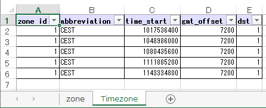

.. _example-excel-table-writer:

Write an Excel table
-------------------------------------------

|ExcelTableWriter| class can write a table to worksheet(s) in 
an Excel workbook file from a matrix of data.

.. include:: exel_single_example.txt

Write multiple Excel tables
-------------------------------------------

.. code-block:: python
    :caption: Sample code

    import pytablewriter

    writer = pytablewriter.ExcelTableWriter()
    writer.open_workbook("sample_multi.xlsx")

    # write the first worksheet
    writer.make_worksheet("zone")
    writer.header_list = ["zone_id", "country_code", "zone_name"]
    writer.value_matrix = [
        ["1", "AD", "Europe/Andorra"],
        ["2", "AE", "Asia/Dubai"],
        ["3", "AF", "Asia/Kabul"],
        ["4", "AG", "America/Antigua"],
        ["5", "AI", "America/Anguilla"],
    ]
    writer.write_table()

    # write the second worksheet
    writer.make_worksheet("Timezone")
    writer.header_list = [
        "zone_id", "abbreviation", "time_start", "gmt_offset", "dst",
    ]
    writer.value_matrix = [
        ["1", "CEST", "1017536400", "7200", "1"],
        ["1", "CEST", "1048986000", "7200", "1"],
        ["1", "CEST", "1080435600", "7200", "1"],
        ["1", "CEST", "1111885200", "7200", "1"],
        ["1", "CEST", "1143334800", "7200", "1"],
    ]
    writer.write_table()

    writer.close()

Output
~~~~~~~~~~~~~~~~~~~~~~~~~~~~

   
   Output excel file (``sample_multi.xlsx``)
